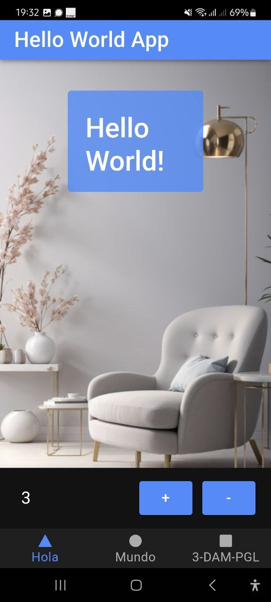
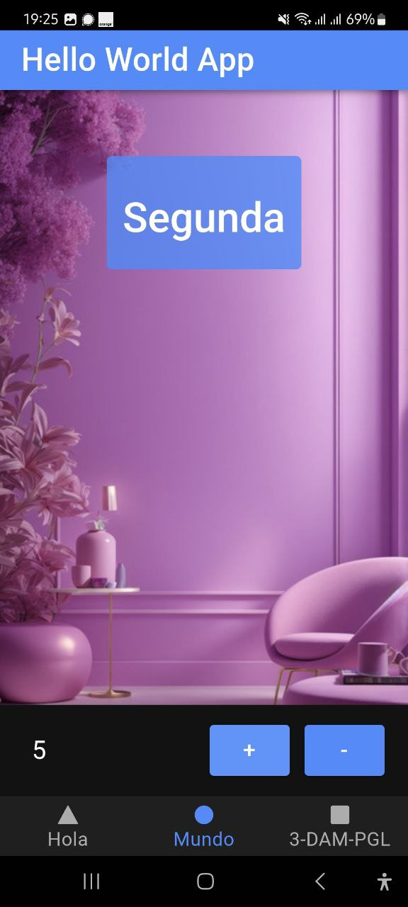
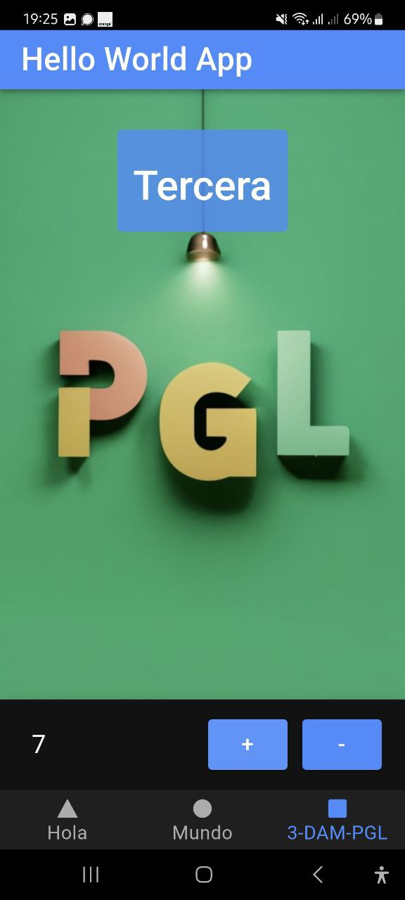

# Actividad_PGL_App_Ionic
Actividad para PGL de aplicación 'Hello World' con Ionic  
### Capturas de pantalla desde movil  
Desde VS Code y mediante Android Studio se paso al aplicacíón a movil para confirmar su funcionamiento. En la parte inferior tiene un elemneto interactión para sumar y restar un conteo y debajo del todo tiene tres iconos geometricos para navegar entre las páginas  
---  

### Imagenes del móvil 
  
Página principal.  
---  

  
Página segunda  
---  

  
Página tercera.  
---  

